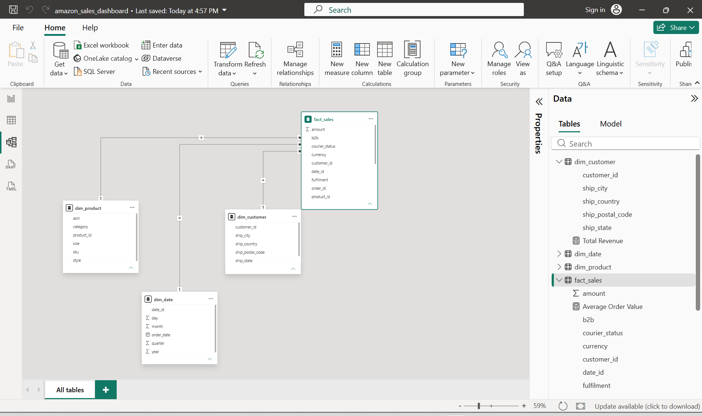
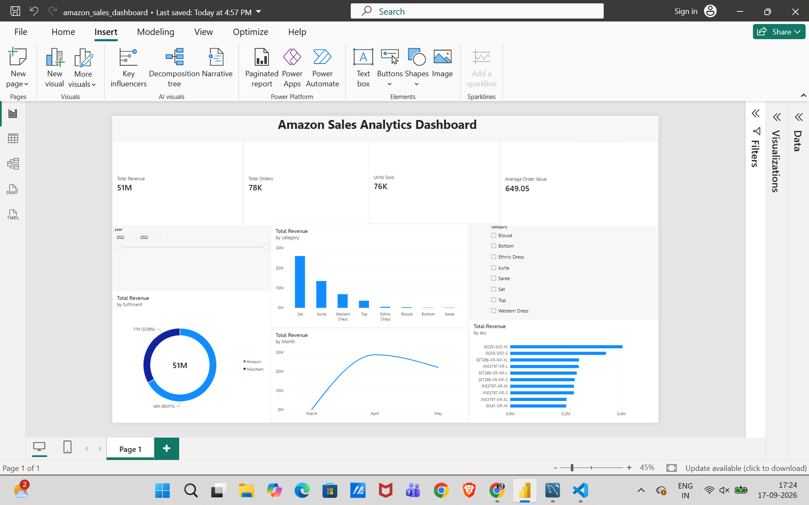

# Amazon Sales Analytics

An end-to-end data analytics project demonstrating data cleaning, ETL development, dimensional data modelling, SQL analysis, and Power BI dashboard development.

---

## Overview

This project transforms raw Amazon sales data into a structured analytical solution using Python, MySQL, SQL, and Power BI.

The workflow covers data extraction and cleaning, database modelling, analytical SQL queries, and interactive business intelligence reporting.

## Project Objectives

- Clean and transform raw sales data using Python and Pandas
- Develop an ETL pipeline for data preparation
- Build a relational analytical database using MySQL
- Design a dimensional data model using fact and dimension tables
- Perform business analysis using SQL
- Develop an interactive Power BI dashboard
- Demonstrate practical data engineering and business intelligence skills

## Technology Stack

| Technology | Purpose |
|------------|---------|
| Python | Data cleaning and ETL |
| Pandas | Data manipulation and transformation |
| MySQL | Relational database and data modelling |
| SQL | Analytical queries |
| Power BI | Interactive dashboard and visualization |
| Git & GitHub | Version control and project management |
| CSV | Source data format |

---

## Project Architecture

```text
Raw Amazon Sales CSV
        |
        v
Python ETL Pipeline
        |
        v
Cleaned Sales Data
        |
        v
MySQL Staging Table
        |
        v
Dimensional Data Model
        |
        +----------------------+
        |                      |
        v                      v
Dimension Tables          Fact Sales
        |                      |
        +----------+-----------+
                   |
                   v
              SQL Analysis
                   |
                   v
           Power BI Dashboard

        Data Pipeline
1. Data Extraction

The raw Amazon sales dataset is loaded from CSV format using Python and Pandas.

2. Data Cleaning

The ETL pipeline performs the following transformations:

Removes the unnecessary index column
Converts order dates into a proper date format
Cleans and standardizes text fields
Handles missing shipping location values
Converts B2B values into database-compatible Boolean values
Removes records missing essential sales information
3. Data Loading

The cleaned dataset is loaded into a MySQL staging table and transformed into a dimensional analytical model consisting of fact and dimension tables.

Database Modelling

The analytical database follows a dimensional modelling approach.

Dimension Tables
dim_customer — shipping location attributes
dim_product — product, SKU, category, size, and ASIN attributes
dim_date — date, day, month, quarter, and year attributes
Fact Table
fact_sales — transactional sales information including orders, quantities, revenue, fulfilment, status, promotions, and B2B information
Relationships

The fact_sales table connects to the dimension tables using foreign keys.

dim_customer  ──── 1 : many ──── fact_sales
dim_product   ──── 1 : many ──── fact_sales
dim_date      ──── 1 : many ──── fact_sales
Data Model

SQL Analysis

SQL queries are used to analyse sales performance from multiple business perspectives.

The analysis includes:

Revenue by product category
Top 10 SKUs by revenue
Monthly revenue trends
Sales and revenue by order status
Top shipping cities by revenue
Revenue by fulfilment method
B2B versus non-B2B sales

The SQL analysis scripts are available in sql/analysis.sql.

Power BI Dashboard

An interactive Power BI dashboard was developed to provide an overview of Amazon sales performance.

Dashboard Metrics
Total Revenue
Total Orders
Units Sold
Average Order Value
Monthly Revenue
Revenue by Category
Top 10 SKUs by Revenue
Revenue by Fulfilment
Year-based filtering
Category filtering
Dashboard Preview

Data Quality

The raw dataset contains 128,975 records and 22 columns.

The Python ETL pipeline produces a cleaned dataset containing 128,975 records and 21 columns after removing the unnecessary index column.

Data quality checks include:

Missing-value analysis
Duplicate-row detection
Data-type validation
Date conversion
Text-field cleaning
Missing shipping location handling
Referential matching between fact and dimension tables

The current MySQL analytical database contains 83,935 loaded sales records.

Project Structure
Amazon-Sales-Analytics/
│
├── data/
│   ├── raw/
│   └── processed/
│
├── docs/
│   ├── dashboard.png
│   └── data_model.png
│
├── powerbi/
│   └── amazon_sales_dashboard.pbix
│
├── python/
│   ├── explore_data.py
│   └── etl_pipeline.py
│
├── sql/
│   ├── analysis.sql
│   └── schema.sql
│
├── .gitignore
├── README.md
└── requirements.txt

How to Run

1. Clone the Repository
git clone https://github.com/Krithikav305/Amazon-Sales-Analytics.git
cd Amazon-Sales-Analytics

2. Install Python Dependencies
pip install -r requirements.txt

3. Run Data Exploration
python python/explore_data.py

4. Run the ETL Pipeline
python python/etl_pipeline.py

5. Set Up MySQL
Create the database and tables using:
sql/schema.sql
Load the cleaned data into the MySQL staging table and populate the dimension and fact tables.

6. Run SQL Analysis
The analytical queries are available in:
sql/analysis.sql

7. Open the Power BI Dashboard
Open:
powerbi/amazon_sales_dashboard.pbix
The dashboard connects to the MySQL analytical database.
Skills Demonstrated
Data Cleaning
ETL Development
Python & Pandas
SQL
Relational Database Design
Dimensional Data Modelling
Fact and Dimension Tables
Data Quality Validation
Business Intelligence
Power BI
Data Visualization
Analytical Problem Solving
Dataset

The project uses a publicly available Amazon sales dataset for educational and portfolio purposes.

The raw CSV file is excluded from Git version control because of its file size.


Krithika Veera Perumal
M.Sc. Data Science
Friedrich-Alexander-Universität Erlangen-Nürnberg